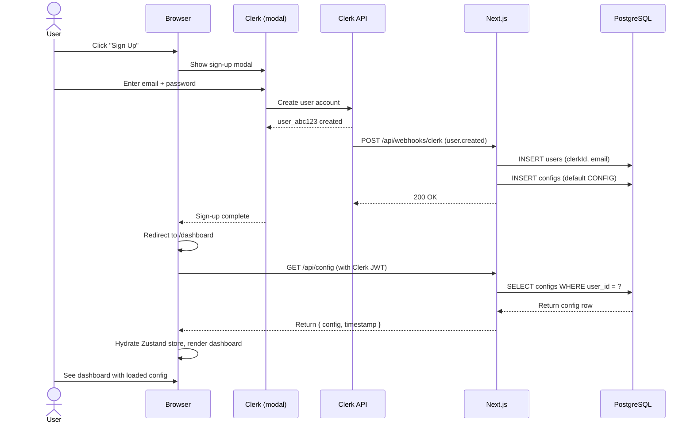

# Authentication and Middleware — RetireAU Dashboard

## Summary

This document specifies the complete Clerk authentication layer, middleware configuration, session management, webhook handling, and security patterns for the RetireAU Dashboard. All protected routes enforce user scoping at the database query level. The auth layer is stateless, using Clerk's JWT tokens for verification.

> **Error codes — source of truth:** every auth-related error code (`AUTH_UNAUTHENTICATED`, `AUTH_FORBIDDEN`, `AUTH_WEBHOOK_INVALID_SIGNATURE`, etc.) is defined in `docs/25-error-taxonomy.md`. Do not invent new `AUTH_*` codes in this doc or in middleware implementation. Follow the change-management protocol in doc 25.

---

## Clerk Setup Overview

### Installation and Configuration

Install the Clerk Next.js SDK:

```bash
npm install @clerk/nextjs
```

Obtain credentials from your Clerk dashboard:

1. **Publishable Key** (`pk_test_` or `pk_live_`): Safe to expose to the browser. Set as `NEXT_PUBLIC_CLERK_PUBLISHABLE_KEY` in `.env.example`.
2. **Secret Key** (`sk_test_` or `sk_live_`): Server-side only. Set as `CLERK_SECRET_KEY`.
3. **Webhook Secret** (`whsec_`): Required for webhook signature verification. Set as `CLERK_WEBHOOK_SECRET`.

All three are listed in `.env.example` and must be populated before the app boots.

### Root Layout Setup

Wrap your app with `ClerkProvider` at the root:

```typescript
// app/layout.tsx
import { ClerkProvider } from '@clerk/nextjs';

export default function RootLayout({
  children,
}: {
  children: React.ReactNode;
}) {
  return (
    <ClerkProvider>
      <html lang="en">
        <body>{children}</body>
      </html>
    </ClerkProvider>
  );
}
```

---

## Middleware Specification

### Middleware File Location

Create `/app/middleware.ts` at the top level of the `app` directory (sibling to `layout.tsx`).

### Route Protection Pattern

```typescript
// app/middleware.ts
import { clerkMiddleware, createRouteMatcher } from '@clerk/nextjs/server';

// Define public routes (no auth required)
const isPublicRoute = createRouteMatcher([
  '/',                           // Landing page
  '/features',                   // Features page
  '/pricing',                    // Pricing page (if it exists)
  '/sign-in(.*)',                // Clerk sign-in modal and related
  '/sign-up(.*)',                // Clerk sign-up modal and related
  '/api/health',                 // Health check (monitoring)
  '/api/webhooks/clerk',         // Clerk webhook receiver
]);

export default clerkMiddleware(async (auth, req) => {
  // If the route is not public, auth() will be called automatically
  // and will throw a 401 redirect to sign-in if not authenticated.
  // If the route IS public, auth() is not called, allowing access.
  if (!isPublicRoute(req)) {
    await auth.protect();
  }
});

// Configure which routes the middleware applies to
export const config = {
  matcher: [
    // Apply middleware to all routes EXCEPT:
    // - Next.js internals (/_next/*)
    // - static files (.css, .js, .jpg, etc.)
    // - public system files (favicon.ico, robots.txt, etc.)
    '/((?!_next|[^?]*\\.(?:html?|css|js(?!on)|jpe?g|webp|gif|svg|ttf|woff2?|ico|csv|docx?|xlsx?|zip|webmanifest)).*)',
    // Always apply to /api routes
    '/api/(.*)',
  ],
};
```

### Protected vs Public Routes

**Protected routes** (require Clerk authentication):

| Route | Purpose |
|-------|---------|
| `/dashboard` | Main dashboard page (client-side rendering, config loading) |
| `/dashboard/*` | All sub-routes of the dashboard |
| `/api/config` (GET) | Load user's saved config from cloud |
| `/api/config` (POST) | Save user's config to cloud |
| `/api/config` (PUT) | Update user's config |
| `/api/config/duplicate` | Create a copy of user's config |
| `/api/sync/resolve` | Resolve a sync conflict |

**Public routes** (no authentication required):

| Route | Purpose |
|-------|---------|
| `/` | Landing page, call to action |
| `/features` | Feature description page |
| `/pricing` | Pricing / signup page (if it exists) |
| `/sign-in` | Clerk pre-built sign-in UI |
| `/sign-up` | Clerk pre-built sign-up UI |
| `/api/health` | Health check for uptime monitoring (responds with 200 if database is reachable) |
| `/api/webhooks/clerk` | Webhook receiver for Clerk events |

---

## Using `auth()` and `currentUser()` in Route Handlers

### Server Components

In server components within protected routes, use the `currentUser()` function:

```typescript
// app/dashboard/page.tsx
import { currentUser } from '@clerk/nextjs/server';

export default async function DashboardPage() {
  const user = await currentUser();
  
  if (!user) {
    // This should not happen if middleware is configured correctly
    return <div>Not authenticated</div>;
  }

  return (
    <div>
      <p>Welcome, {user.emailAddresses[0].emailAddress}</p>
      <Dashboard userId={user.id} />
    </div>
  );
}
```

### Route Handlers (API Routes)

In `/api/config/route.ts`, extract userId from the auth token:

```typescript
// app/api/config/route.ts
import { auth } from '@clerk/nextjs/server';
import { prisma } from '@/lib/db';

export async function GET(req: Request) {
  const { userId } = await auth();
  
  if (!userId) {
    return Response.json(
      { error: { code: 'UNAUTHORIZED', message: 'Not authenticated' } },
      { status: 401 }
    );
  }

  // userId is now guaranteed to be set
  const config = await prisma.config.findFirst({
    where: {
      user: { clerkId: userId },
      isActive: true,
    },
  });

  if (!config) {
    return Response.json({ config: null, timestamp: null }, { status: 200 });
  }

  return Response.json({
    config: config.config,
    timestamp: config.updatedAt.getTime(),
  });
}
```

---

## User-Scoping Rule (#1 Security Requirement)

**EVERY database query must be scoped by `userId` derived from Clerk's `auth()` call.** Never trust userId from request body, query params, or any client-supplied data.

### Anti-Pattern (FORBIDDEN)

```typescript
// NEVER DO THIS
const { userId } = req.body; // Trusting client input
const config = await prisma.config.findFirst({
  where: { user: { clerkId: userId } }, // userId could be forged
});
```

### Correct Pattern (REQUIRED)

```typescript
// CORRECT
const { userId: clerkId } = await auth(); // From Clerk JWT token
if (!clerkId) return Response.json({ error: 'Unauthorized' }, { status: 401 });

const config = await prisma.config.findFirst({
  where: { user: { clerkId } }, // Using Clerk-verified userId only
});
```

Apply this pattern to every API endpoint that touches the database.

---

## 401 vs 403 Error Handling

### 401 Unauthorized

**When**: User is not signed in (no valid Clerk JWT token).

**Behavior**: Middleware automatically redirects to sign-in (`NEXT_PUBLIC_CLERK_SIGN_IN_URL`).

**API Response** (if middleware is bypassed):
```json
{
  "error": {
    "code": "UNAUTHORIZED",
    "message": "Clerk authentication required. Please sign in."
  }
}
```

### 403 Forbidden

**When**: User is signed in, but is trying to access a resource that belongs to a different user (or lacks permission).

**API Response**:
```json
{
  "error": {
    "code": "FORBIDDEN",
    "message": "You do not have permission to access this resource."
  }
}
```

**Example implementation**:
```typescript
export async function GET(req: Request, { params }: { params: { configId: string } }) {
  const { userId } = await auth();
  if (!userId) {
    return Response.json({ error: { code: 'UNAUTHORIZED', ... } }, { status: 401 });
  }

  const config = await prisma.config.findFirst({
    where: { id: params.configId },
  });

  // Verify the config belongs to the signed-in user
  const user = await prisma.user.findUnique({
    where: { clerkId: userId },
  });

  if (!user || config.userId !== user.id) {
    return Response.json(
      { error: { code: 'FORBIDDEN', message: 'You do not have permission to access this resource.' } },
      { status: 403 }
    );
  }

  return Response.json({ config });
}
```

---

## Clerk Webhook Handler

### Purpose

The webhook fires on two events: `user.created` (on signup) and `user.deleted` (if the user deletes their account in Clerk). The handler creates or deletes the corresponding `User` row in Postgres and initialises the default CONFIG.

### Endpoint: POST /api/webhooks/clerk

```typescript
// app/api/webhooks/clerk/route.ts
import { Webhook } from 'svix';
import { prisma } from '@/lib/db';

const webhookSecret = process.env.CLERK_WEBHOOK_SECRET;

export async function POST(req: Request) {
  // 1. Verify webhook signature
  const payload = await req.text();
  const headers = req.headers;
  const wh = new Webhook(webhookSecret);

  let event;
  try {
    event = wh.verify(payload, Object.fromEntries(headers)) as ClerkWebhookEvent;
  } catch (err) {
    console.error('Webhook signature verification failed:', err);
    return Response.json({ error: 'Invalid signature' }, { status: 401 });
  }

  // 2. Handle user.created event
  if (event.type === 'user.created') {
    const { id: clerkId, email_addresses, created_at } = event.data;
    const email = email_addresses[0].email_address;

    // Upsert: if user already exists, do nothing (idempotent)
    const user = await prisma.user.upsert({
      where: { clerkId },
      update: {},
      create: {
        clerkId,
        email,
        createdAt: new Date(created_at),
      },
    });

    // Initialise default config for new user
    await prisma.config.upsert({
      where: { userId_isActive: { userId: user.id, isActive: true } },
      update: {},
      create: {
        userId: user.id,
        schemaVersion: 1,
        config: DEFAULT_CONFIG, // See docs/07-config-reference.md
        isActive: true,
      },
    });

    return Response.json({ success: true }, { status: 200 });
  }

  // 3. Handle user.deleted event
  if (event.type === 'user.deleted') {
    const { id: clerkId } = event.data;

    // Delete user and all related configs (cascading)
    await prisma.user.delete({
      where: { clerkId },
    });

    return Response.json({ success: true }, { status: 200 });
  }

  // Ignore other events
  return Response.json({ success: true }, { status: 200 });
}

// Type definition for Clerk webhook payload
type ClerkWebhookEvent = {
  type: 'user.created' | 'user.deleted' | string;
  data: {
    id: string;
    email_addresses: Array<{ email_address: string }>;
    created_at: number;
  };
};
```

### Webhook Signature Verification

Use the `svix` library (Clerk's webhook signing library) to verify the signature:

```bash
npm install svix
```

The handler extracts the signature from request headers and verifies it against `CLERK_WEBHOOK_SECRET`. If verification fails, return 401. If verification passes, process the event.

### Idempotency

The webhook may fire multiple times for the same event (network retries, Clerk platform retries). Implement idempotency using `upsert` rather than `create`:

```typescript
// If user already exists, this does nothing (silently succeeds)
await prisma.user.upsert({
  where: { clerkId },
  update: {},
  create: { clerkId, email },
});
```

**Note:** `user.deleted` is defense-in-depth. The primary account deletion path is `DELETE /api/user` (see docs/11-api-contracts.md), which deletes the user from Postgres first, then calls the Clerk API. The webhook handles any deletion that bypasses the app (e.g., deletion via the Clerk dashboard).

---

## Webhook Race Condition: User Signs In Before Webhook Completes

**Scenario**: User completes signup in Clerk → webhook is queued but hasn't fired yet → user's browser calls GET `/api/config` → no user row exists in Postgres.

**Solution**: Lazy-create the user row on first API call.

```typescript
// app/api/config/route.ts
import { auth } from '@clerk/nextjs/server';
import { prisma } from '@/lib/db';

export async function GET(req: Request) {
  const { userId: clerkId } = await auth();
  if (!clerkId) {
    return Response.json({ error: 'Unauthorized' }, { status: 401 });
  }

  // Lazy-create user if they don't exist (in case webhook hasn't fired yet)
  let user = await prisma.user.findUnique({
    where: { clerkId },
  });

  if (!user) {
    const clerkUser = await clerkClient.users.getUser(clerkId);
    user = await prisma.user.create({
      data: {
        clerkId,
        email: clerkUser.emailAddresses[0].emailAddress,
      },
    });

    // Also create default config
    await prisma.config.create({
      data: {
        userId: user.id,
        schemaVersion: 1,
        config: DEFAULT_CONFIG,
        isActive: true,
      },
    });
  }

  // Proceed with normal GET logic
  const config = await prisma.config.findFirst({
    where: { userId: user.id, isActive: true },
  });

  return Response.json({
    config: config?.config ?? null,
    timestamp: config?.updatedAt.getTime() ?? null,
  });
}
```

---

## Session Management

### JWT Refresh

Clerk automatically refreshes JWT tokens before expiry. No explicit refresh logic is required on the client. The Clerk SDK handles this transparently.

### Session Expiry

Default Clerk session duration is 24 hours. When a session expires, the browser is redirected to sign-in on the next authenticated request. This is handled automatically by `clerkMiddleware`.

### Sign-Out Behavior

When a user clicks the sign-out button (typically in a Clerk-provided UI component):

```typescript
import { useClerk } from '@clerk/nextjs';

export function SignOutButton() {
  const { signOut } = useClerk();
  return (
    <button onClick={() => signOut()}>
      Sign Out
    </button>
  );
}
```

On sign-out:
- Clerk's session token is invalidated
- User is redirected to the home page
- localStorage persists (user can still view the dashboard offline)
- Cloud sync stops (no more API calls on config changes)

---

## Sign-In and Sign-Up Flows

### Recommended: Clerk Pre-Built UI

For v1, use Clerk's pre-built sign-in and sign-up pages. This reduces implementation complexity and leverages Clerk's multi-factor auth and account linking.

```typescript
// app/sign-in/[[...sign-in]]/page.tsx
import { SignIn } from '@clerk/nextjs';

export default function SignInPage() {
  return <SignIn />;
}
```

```typescript
// app/sign-up/[[...sign-up]]/page.tsx
import { SignUp } from '@clerk/nextjs';

export default function SignUpPage() {
  return <SignUp />;
}
```

Configure redirect behaviour in `.env.example`:

```bash
NEXT_PUBLIC_CLERK_SIGN_IN_URL=/sign-in
NEXT_PUBLIC_CLERK_SIGN_UP_URL=/sign-up
NEXT_PUBLIC_CLERK_AFTER_SIGN_IN_URL=/dashboard
NEXT_PUBLIC_CLERK_AFTER_SIGN_UP_URL=/dashboard
```

### Alternative: Custom Sign-In UI

If branding requires a fully custom form, use `signIn()` and `signUp()` methods from `useSignIn()` and `useSignUp()` hooks. This is more complex and deferred to post-v1.

---

## Error Cases and Recovery

### Case 1: Expired Session

**Symptom**: User is signed in, but their JWT has expired.

**Behaviour**: 
- Next API call from the dashboard returns 401.
- Middleware redirects to sign-in.
- User clicks "Sign In", completes Clerk flow, and is redirected back to `/dashboard`.
- Dashboard component re-fetches config and resumes normal operation.

### Case 2: Revoked Clerk Key

**Symptom**: User's Clerk account is deleted, or their key is revoked in Clerk's system.

**Behaviour**:
- Clerk SDK detects revocation, signs user out.
- Dashboard falls back to localStorage.
- User can still access the dashboard in local-only mode.
- Signing in again with a new Clerk account starts fresh.

### Case 3: Webhook Race Condition (User Exists, Config Missing)

**Scenario**: Webhook fires and creates user, but doesn't create config (database error, timeout).

**Detection & Recovery**:
- GET `/api/config` returns null config → frontend shows default config.
- User begins editing → POST `/api/config` creates the config row on first save.
- Subsequent calls succeed normally.

---

## Testing Clerk Authentication

### Mocking Clerk in Unit Tests

Use Clerk's test helpers to mock `auth()` and `currentUser()`:

```typescript
// __tests__/api/config.test.ts
import { auth, currentUser } from '@clerk/nextjs/server';
import { GET } from '@/app/api/config/route';

jest.mock('@clerk/nextjs/server');

describe('GET /api/config', () => {
  it('returns 401 if not authenticated', async () => {
    (auth as jest.Mock).mockResolvedValue({ userId: null });

    const res = await GET(new Request('http://localhost/api/config'));
    expect(res.status).toBe(401);
  });

  it('returns user config if authenticated', async () => {
    (auth as jest.Mock).mockResolvedValue({ userId: 'user_abc123' });
    // Mock Prisma to return a config
    jest.spyOn(prisma.config, 'findFirst').mockResolvedValue({
      id: 'cfg_1',
      userId: 'user_1',
      config: { schemaVersion: 1, ... },
      updatedAt: new Date(),
      ...
    });

    const res = await GET(new Request('http://localhost/api/config'));
    expect(res.status).toBe(200);
    const body = await res.json();
    expect(body.config).toBeDefined();
  });
});
```

### E2E Testing with Real Clerk (Staging)

For integration tests, use Clerk's test mode or a staging Clerk app with test credentials (email/password sign-in without verification). Reference `docs/10-test-fixtures.md` for Fixture B and C personas to seed during E2E tests.

---

## Security Notes

### CSRF Protection

Clerk's SDK handles CSRF automatically. The middleware sets secure, SameSite cookies for session tokens (when cookies are used). Same-origin requests are safe by default.

### XSS Prevention

React automatically escapes values by default. Never use `dangerouslySetInnerHTML` with user-supplied data.

```typescript
// SAFE (default)
<div>{user.email}</div>

// DANGEROUS (never do this with user data)
<div dangerouslySetInnerHTML={{ __html: user.email }} />
```

### SQL Injection Prevention

Prisma uses parameterised queries. User IDs derived from Clerk are treated as parameters, never string concatenation.

```typescript
// SAFE
const config = await prisma.config.findFirst({
  where: { user: { clerkId } }, // clerkId is parameterised
});

// DANGEROUS (never do this)
const config = await db.query(`SELECT * FROM configs WHERE user_id = '${clerkId}'`);
```

---

## Sign-Up Flow Sequence Diagram



---

## Summary Checklist

- [ ] Install `@clerk/nextjs` and configure publishable/secret keys in `.env.local`
- [ ] Create `/app/middleware.ts` with public route matcher and `clerkMiddleware`
- [ ] Wrap root layout with `<ClerkProvider>`
- [ ] Create `/app/api/webhooks/clerk/route.ts` with signature verification and user/config creation
- [ ] Add Clerk webhook endpoint URL to Clerk dashboard (e.g., `https://retire.example.com.au/api/webhooks/clerk`)
- [ ] Implement lazy-create fallback in every authenticated API route
- [ ] Verify every database query is scoped by Clerk-derived userId (not client-supplied)
- [ ] Test sign-up flow locally with Clerk test keys
- [ ] Test webhook firing (check Clerk dashboard → Webhooks → Recent Attempts)
- [ ] Test 401 and 403 error handling in component tests
